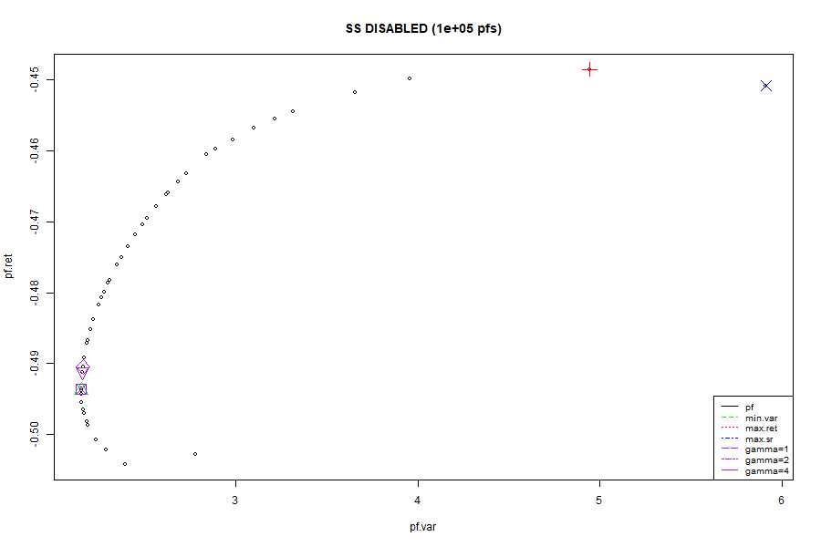
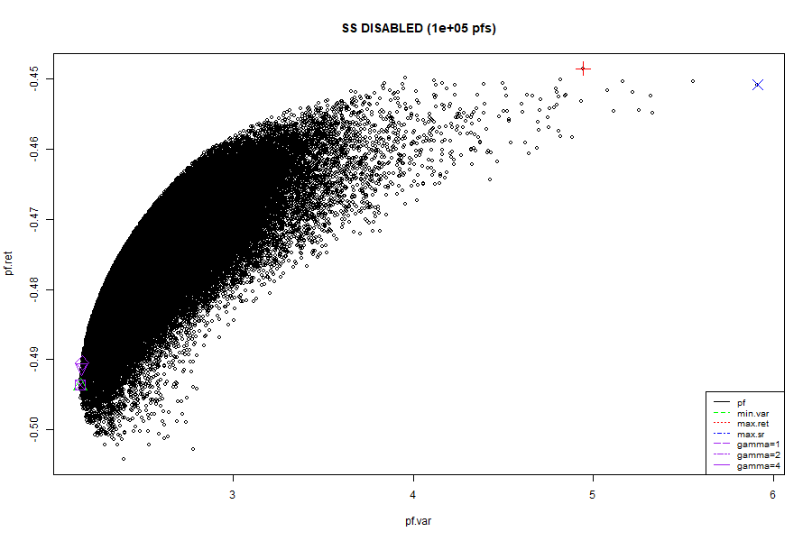
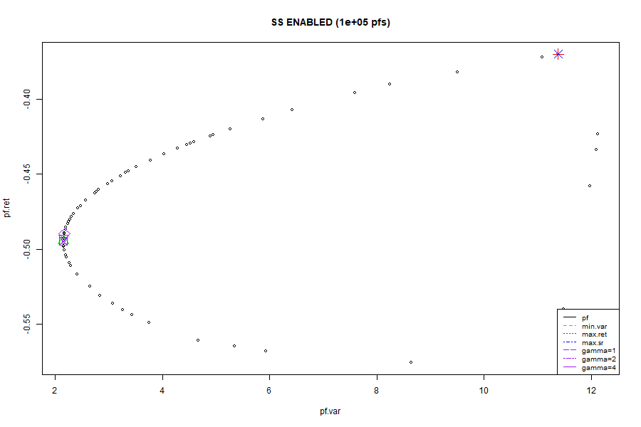
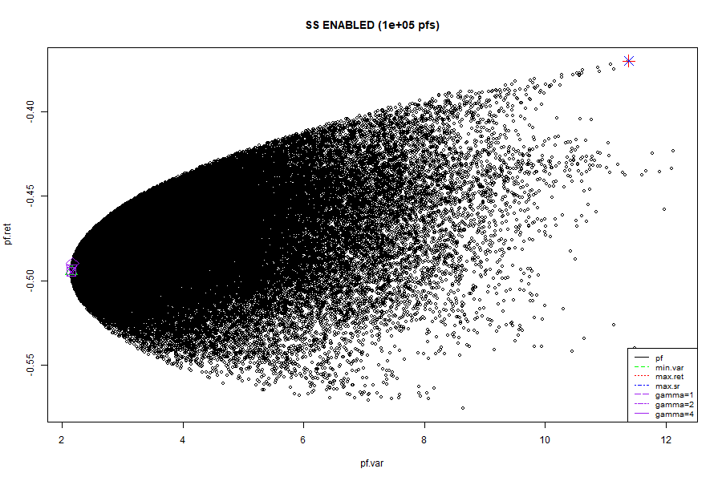

# Example 1

```
# data range
start_date <- as.Date("2010-01-01")
end_date <- as.Date("2023-01-01")


# stocks and risk free rate (proxy)
stocks <- c("AAPL", "MSFT", "GOOG", "AMZN", "NVDA")
risk.free <- c("DGS3MO")

# split: 2500 for train, 500 for test

# expected returns of excess returns
R <- matrix(apply(df_train[,excess.ret.colnames], 2, mean),N,1)

           [,1]
[1,] -0.4737043
[2,] -0.5027725
[3,] -0.5065042
[4,] -0.4528628
[5,] -0.4439606

# VCV of the excess returns
C <- matrix(cov(df_train[,excess.ret.colnames]),N,N)

        [,1]     [,2]     [,3]     [,4]     [,5]
[1,] 3.298267 1.673806 1.812462 1.919518 2.213581
[2,] 1.673806 2.654529 1.811871 1.991460 2.260596
[3,] 1.812462 1.811871 3.035977 2.341486 2.232362
[4,] 1.919518 1.991460 2.341486 4.486639 2.467930
[5,] 2.213581 2.260596 2.232362 2.467930 7.039019
```

## 100k pfs simulated with w.min=0, w.max=1




```
> print.pf.opt(opt.pf.nss, title=title.nss)
--------------------------------------------------
SS DISABLED (100000 pfs)
--------------------------------------------------
Minimum variance
Return:       -0.495
Variance (*): 2.152
Sharpe-ratio: -0.337
Weights: 
AAPL  MSFT  GOOG  AMZN  NVDA  
0.25  0.46  0.25  0.03  0  
--------------------------------------------------
Maximum return
Return (*):   -0.449
Variance:     5.505
Sharpe-ratio: -0.191
Weights: 
AAPL  MSFT  GOOG  AMZN  NVDA  
0  0.04  0.02  0.13  0.81  
--------------------------------------------------
Maximum sharpe ratio
Return:           -0.451
Variance:         5.93
Sharpe-ratio (*): -0.185
Weights: 
AAPL  MSFT  GOOG  AMZN  NVDA  
0  0.06  0.06  0.01  0.88  
--------------------------------------------------
Maximum utility (gamma=1)
Return:           -0.491
Variance:         2.161
Sharpe-ratio:     -0.334
Weights: 
AAPL  MSFT  GOOG  AMZN  NVDA  
0.28  0.41  0.22  0.09  0.01  
--------------------------------------------------
Maximum utility (gamma=2)
Return:           -0.491
Variance:         2.161
Sharpe-ratio:     -0.334
Weights: 
AAPL  MSFT  GOOG  AMZN  NVDA  
0.28  0.41  0.22  0.09  0.01  
--------------------------------------------------
Maximum utility (gamma=4)
Return:           -0.495
Variance:         2.152
Sharpe-ratio:     -0.337
Weights: 
AAPL  MSFT  GOOG  AMZN  NVDA  
0.25  0.46  0.25  0.03  0  
--------------------------------------------------

```

## 100k pfs simulated with w.min=-1, w.max=1



```
--------------------------------------------------
SS ENABLED (100000 pfs)
--------------------------------------------------
Minimum variance
Return:       -0.495
Variance (*): 2.15
Sharpe-ratio: -0.337
Weights: 
AAPL  MSFT  GOOG  AMZN  NVDA  
0.25  0.45  0.26  0.05  -0.01  
--------------------------------------------------
Maximum return
Return (*):   -0.364
Variance:     12.224
Sharpe-ratio: -0.104
Weights: 
AAPL  MSFT  GOOG  AMZN  NVDA  
0.96  -0.94  -0.98  0.98  0.99  
--------------------------------------------------
Maximum sharpe ratio
Return:           -0.364
Variance:         12.224
Sharpe-ratio (*): -0.104
Weights: 
AAPL  MSFT  GOOG  AMZN  NVDA  
0.96  -0.94  -0.98  0.98  0.99  
--------------------------------------------------
Maximum utility (gamma=1)
Return:           -0.489
Variance:         2.168
Sharpe-ratio:     -0.332
Weights: 
AAPL  MSFT  GOOG  AMZN  NVDA  
0.31  0.38  0.21  0.09  0.01  
--------------------------------------------------
Maximum utility (gamma=2)
Return:           -0.493
Variance:         2.153
Sharpe-ratio:     -0.336
Weights: 
AAPL  MSFT  GOOG  AMZN  NVDA  
0.25  0.43  0.25  0.06  0  
--------------------------------------------------
Maximum utility (gamma=4)
Return:           -0.495
Variance:         2.15
Sharpe-ratio:     -0.337
Weights: 
AAPL  MSFT  GOOG  AMZN  NVDA  
0.25  0.45  0.26  0.05  -0.01  
--------------------------------------------------
```